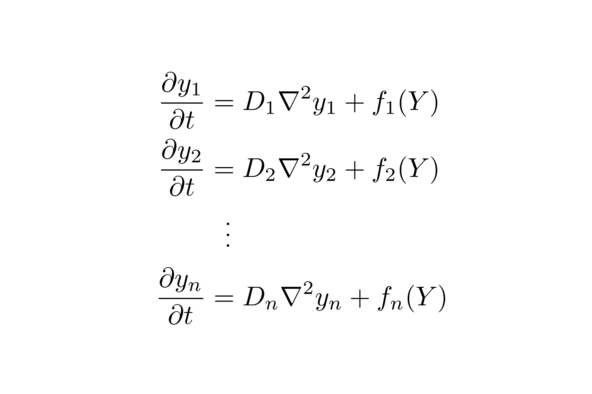
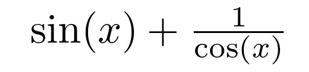

# TeXDown

A python package that adds simple syntax to markdown files to make Github friendly LaTeX

#### Package Requirements
* matplotlib
* tqdm

It is always best to use the latest version of these packages.

---

## Example Usage and Syntax

Using **TeXDown** is simple as it uses already familiar syntax to markdown files that
allows for creating inline LaTeX, display LaTeX, and LaTeX code blocks.

### Current Limitations
* Using matplotlib's LaTeX abilities is convienient but not as powerful as creating
  actual LaTeX (i.e. some things just don't work like normal LaTeX)
* Inlined equations are a bit raised
* Converting can become slow if tons of LateX is used

### Latex Code Blocks
Just like you would do if you wanted to add a Python code block to a markdown file,
you add three back-ticks and the language name, write the latex commands, then finish it with another three back-ticks. In this case the language name is `latex`. Example latex code-block would be

```
```latex 
\begin{split}
    \frac{\partial y_1}{\partial t} &= D_1 \nabla^2 y_1 + f_1(Y) \\
    \frac{\partial y_2}{\partial t} &= D_2 \nabla^2 y_2 + f_2(Y) \\
    &\ \ \vdots \\
    \frac{\partial y_n}{\partial t} &= D_n \nabla^2 y_n + f_n(Y) \\
\end{split}
 ```
```

which results in,

<p align="center">
  
</p>

If the image is not large enough (or too large), the user can specify
`height="<an integer>"` to set the height while preserving the aspect
ratio. If the aspect ratio does not matter more options like `width` can also be specified.

### Latex Display Mode
Similarly to defining something in display mode in standard LaTeX,
the user can put an equation like `\sin(x) + \frac{1}{cos(x)}` on it's own line by using two `$` the on a new line (similar to a code block)
place the latex code, then on another new line, add another two `$`.
Again height can be adjusted.

```
$$ 
\sin(x) + \frac{1}{cos(x)}
$$
```

<p align="center">
  
</p>

### Latex Inline Mode
Inlining LaTeX, is done with the `<tex src="<some LaTeX commands>">` command. This will output LaTeX inline with the other surrounding text. However, the spacing is pretty buggy and needs work, so consider not using this if it is too messy for your preferences. Example `<tex src="\sin(x) + \frac{1}{\cos(x)}">` would produce
, which is slighty raised for some reason.

### Applying changes to README.md

To create a Github-friendly markdown file, run the following in terminal

```
python -m texdown README.md
```
    
this will generate `README-out.md` which will be the properly formatted version. You can also specify the name of the output file by using the `-o` flag.

```
python -m texdown README.md -o README
```

## TODO
* fix inlining
* stop being dependent on matplotlib
* allow for more complex TeX commands


